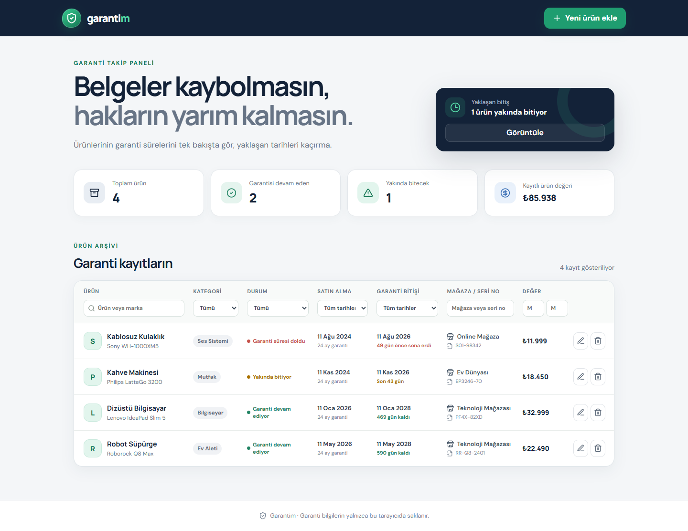
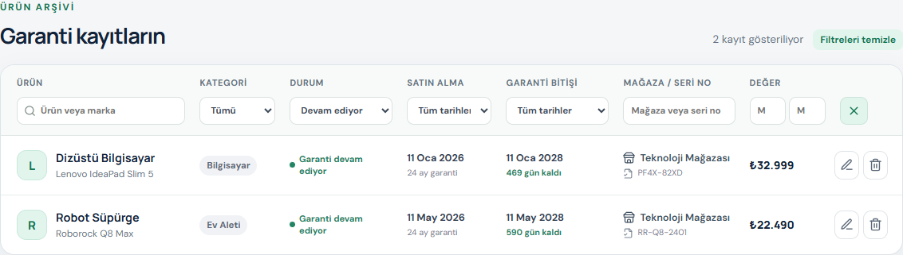
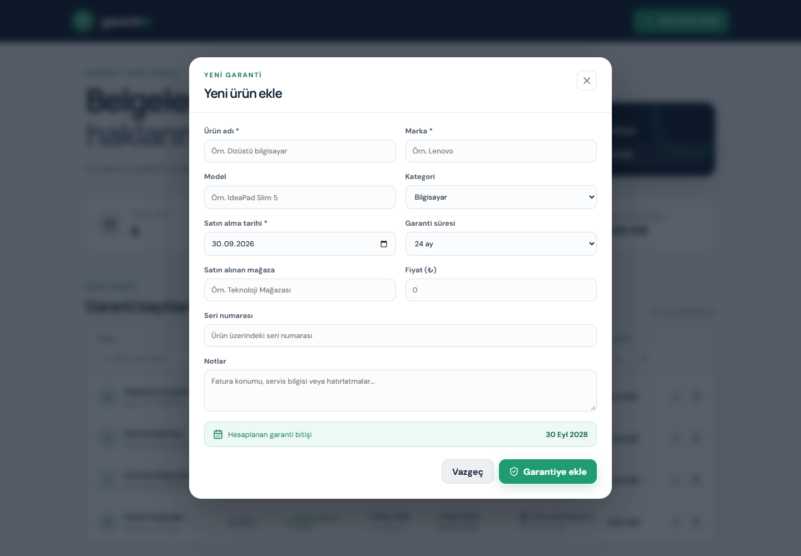

# Garantim

Garantim, satın alınan ürünlerin garanti sürelerini tek yerde takip etmeyi sağlayan responsive bir React uygulamasıdır.

## Ekran görüntüleri

### Garanti takip paneli



### Sütun bazlı filtreleme



### Yeni ürün ve garanti kaydı



## Özellikler

- Ürün ve garanti kaydı ekleme
- Kayıtları listeleme, arama ve filtreleme
- Ürün bilgilerini güncelleme
- Garanti kaydı silme
- Garanti bitiş tarihini otomatik hesaplama
- Yakında bitecek ve süresi dolmuş garantileri ayırma
- Kategori ve durum filtreleri
- LocalStorage ile tarayıcıda kalıcı veri
- Mobil ve masaüstü uyumlu arayüz

## Kullanılan teknolojiler

- React
- TypeScript
- Vite
- Lucide Icons
- CSS
- LocalStorage

## Yerel kurulum

```bash
npm install
npm run dev
```

## Production build

```bash
npm run build
```

Proje `netlify.toml` dosyasıyla Netlify dağıtımına hazırdır. Build komutu `npm run build`, yayın klasörü `dist` olarak ayarlanmıştır.
